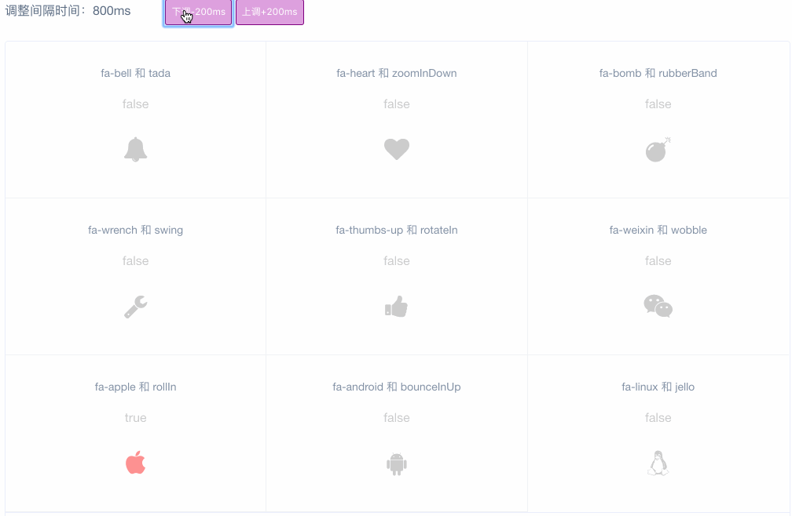

# vue-star-plus

> 升级版 [vue-star](https://github.com/OYsun/VueStar)

[DEMO](https://savoygu.github.io/vue-star-plus/)

## 演示



## VS

原组件实现的功能：

- 点赞的图标可定制
- 点赞的动画可定制

该组件做的一些改进：

- 可以把图标指定为激活状态
- 可以把图标替换为图片
- 支持点赞完成的后续操作

## 安装

```javascript
npm i vue-star-plus --save
```

## 使用

```javascript
import VueStarPlus from 'vue-star-plus'
import 'vue-star-plus/vue-star-plus.css'
Vue.component('vue-star-plus', VueStarPlus)
```

## Build Setup

``` bash
# install dependencies
npm install

# serve with hot reload at localhost:8080
npm run demo:dev

# build for demo with minification
npm run demo:build

# build for gh-pages with minification
npm run demo:prepublish

# build for production with minification
npm run build
```
